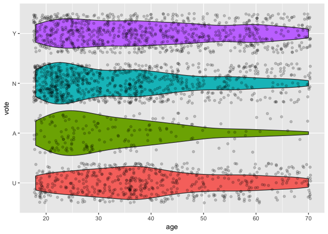

Stat545 Homework 2
================
Eric Sanders
Submitted for 2018-09-25


In this document we present some data exploration completed using the `Chile` dataset. We will use the packages `tidyverse`, `ggplot2`, and `carData`.

``` r
library(tidyverse)
library(ggplot2)
library(carData)
```

Loading in Data and Examining its Structure
===========================================

First, we load the data

``` r
# Call to preloaded data frame
data(Chile)
```

Next, we can look at some information on how this data set is organized.

``` r
# Determine what we can about the object Chile
str(Chile)
```

    ## 'data.frame':    2700 obs. of  8 variables:
    ##  $ region    : Factor w/ 5 levels "C","M","N","S",..: 3 3 3 3 3 3 3 3 3 3 ...
    ##  $ population: int  175000 175000 175000 175000 175000 175000 175000 175000 175000 175000 ...
    ##  $ sex       : Factor w/ 2 levels "F","M": 2 2 1 1 1 1 2 1 1 2 ...
    ##  $ age       : int  65 29 38 49 23 28 26 24 41 41 ...
    ##  $ education : Factor w/ 3 levels "P","PS","S": 1 2 1 1 3 1 2 3 1 1 ...
    ##  $ income    : int  35000 7500 15000 35000 35000 7500 35000 15000 15000 15000 ...
    ##  $ statusquo : num  1.01 -1.3 1.23 -1.03 -1.1 ...
    ##  $ vote      : Factor w/ 4 levels "A","N","U","Y": 4 2 4 2 2 2 2 2 3 2 ...

From this we can see that `Chile` is of class 'data.frame', with 2700 rows and 8 columns (variables) that have names and structures as provided. Specifically, we have four categorical variables `region`,`sex`,`education`,`vote` and four numerical variables `population`,`age`,`income`,`statusquo`.

The `str` is useful because it reported all of this information about the data structure at once. We were able to state an object type, both object dimensions, the names of the variables included, and each variables structure as well. The `str` function only becomes less useful in cases with more complicated object structure. If one isn't sure about how complicated an object's structure is, they may wish to try using individual functions to piece together this information, as follows

``` r
# Determine class
class(Chile)
```

    ## [1] "data.frame"

``` r
# Determine number of rows
nrow(Chile)
```

    ## [1] 2700

``` r
# Determine number of columns
ncol(Chile)
```

    ## [1] 8

``` r
# Determine variable names
names(Chile)
```

    ## [1] "region"     "population" "sex"        "age"        "education" 
    ## [6] "income"     "statusquo"  "vote"

``` r
# For each variable name, report class of that variable's values
sapply(1:ncol(Chile),function(i) cbind(names(Chile)[i],class(Chile[,i]))) %>% 
  t() %>% 
  noquote()
```

    ##      [,1]       [,2]   
    ## [1,] region     factor 
    ## [2,] population integer
    ## [3,] sex        factor 
    ## [4,] age        integer
    ## [5,] education  factor 
    ## [6,] income     integer
    ## [7,] statusquo  numeric
    ## [8,] vote       factor

We see how, by using some more cumbersome functions one by one, we could gather all the information that the `str` function gave us right away. However, these functions have the benefit of being more simple in their execution, so they would be useful in situations with confusing object structure.

Looking at Data, Forming Some Summaries
=======================================

We will look at the four categorical variables, as well as two of the numerical variables in this data set. We will not be looking at `region` or `population` or `statusquo`. We will also only be using data without missing values (I'm educated in multiple imputation and assessing types of missing data, but I didn't want to get carried away for this homework so I will only use complete cases).

``` r
# Remove unwanted variables
Chile = Chile %>% 
  select(-population,-statusquo,-region)
# Remove incomplete cases
Chile = Chile %>% 
  filter(complete.cases(.))
```

We see there is now a different number of rows and columns in our data set:

``` r
str(Chile)
```

    ## 'data.frame':    2439 obs. of  5 variables:
    ##  $ sex      : Factor w/ 2 levels "F","M": 2 2 1 1 1 1 2 1 1 2 ...
    ##  $ age      : int  65 29 38 49 23 28 26 24 41 41 ...
    ##  $ education: Factor w/ 3 levels "P","PS","S": 1 2 1 1 3 1 2 3 1 1 ...
    ##  $ income   : int  35000 7500 15000 35000 35000 7500 35000 15000 15000 15000 ...
    ##  $ vote     : Factor w/ 4 levels "A","N","U","Y": 4 2 4 2 2 2 2 2 3 2 ...

The data set `Chile` is a set of survey responses indicating some demographic information as well as voting intensions in an important 1988 Chile vote on a matter important to the whole country.

These variables can be described as follows:

-   **sex**: An factor indicator of sex, either Male or Female.
-   **age**: A numerical value indicating age in years.
-   **education**: A factor with three levels:
    -   **P**: Primary school completed
    -   **S**: Secondary school completed
    -   **PS**: Post-Secondary school completed
-   **income**: Monthly income in Pesos.
-   **vote**: Factor, intended reponse in the upcoming vote. Levels:
    -   **A**: Abstain
    -   **N**: Will vote no
    -   **U**: Unsure
    -   **Y**: Will vote yes

We can form a table to summarize numerical values, as well as a slightly different table to summarize factor values. We will populate the numerical summary table using the `mean()`, `sd()`, `min()`, and `max()` functions.

| Variable | Mean     | S.D.     | Minimum | Maximum |
|----------|----------|----------|---------|---------|
| Age      | 38.3     | 14.67    | 18      | 70      |
| Income   | 34041.62 | 39709.92 | 2500    | 200000  |

For each categorical variable, we can calculate the number of instances of each level by using the following example code structure (example given for counting number of respondants who are male)

``` r
# Count number of people responding from region C
Chile %>% 
  filter(sex=='M') %>% 
  nrow()
```

    ## [1] 1183

Thusly, we populate:

| Factor    | Level | Number Recorded | Percent Total |
|-----------|-------|-----------------|---------------|
| Sex       | M     | 1183            | 0.49          |
|           | F     | 1256            | 0.51          |
| Education | P     | 1006            | 0.41          |
|           | S     | 1011            | 0.41          |
|           | PS    | 422             | 0.17          |
| Vote      | A     | 179             | 0.07          |
|           | N     | 867             | 0.36          |
|           | U     | 556             | 0.23          |
|           | Y     | 837             | 0.34          |

The above tables contain a great deal of information, but we aren't able to compare any of the variables yet based on this information alone. All that we know is that we have a group of individuals aged 18 to 70 who make anywhere from 2,500 to 200,000 Pesos a year, and who represent a range of educational backgrounds and predicted voting responses.

Exploring Relationships in the Data
===================================

Exploring Which Variables Have an Observable Relationship with Vote Response
----------------------------------------------------------------------------

Now that we have an understanding of the data structure, we can begin to explore how the variables may relate to each other.

In this data set, the primary outcome of interest is likely to be which response each person intends to give for the vote. It may thus be of interest to explore how these responses vary between subgroups of the population. We can explore this using violin plots. Let us begin by looking at the age distribution of each voting group.

``` r
# Re-order levels of vote from U to A to N to Y for interpretation
cor.vote.order = c('U','A','N','Y')
correct.vote = data.frame(vote = as.character(Chile$vote), 
                             stringsAsFactors = FALSE) %>%
        mutate(vote = factor(vote, 
                            levels = cor.vote.order))
Chile$vote = correct.vote$vote

# Rename levels of Education
levels(Chile$education) = c('Primary','Post-Secondary','Secondary')
# Re-order levels of Education from low to high
cor.class.order = c('Primary','Secondary','Post-Secondary')
correct.education = data.frame(education = as.character(Chile$education), 
                             stringsAsFactors = FALSE) %>%
        mutate(education = factor(education, 
                            levels = cor.class.order))
Chile$education = correct.education$education

# Plot age vs. vote
g1 = ggplot(data=Chile,aes(x=vote,y=age))
g1 + geom_violin(aes(fill=vote)) + 
  geom_jitter(alpha=0.2) + 
  coord_flip() + 
  theme(legend.position='none')
```



Visually interpreting this, it may appear as though abstainers and those who will vote 'no' are on average younger than those who will vote 'yes' or those who are uncertain which option to vote.

Let us examine if perhaps education may be related to voting pattern. We can compare bar plots of vote responses split up by education status. It will take some calculations to make each bar plot present a **percentage out of everyone in one education group** that selects a certain voting option, but this will allow for us to compare the distribution of voting options between education levels.

``` r
# Collect percentages in a new data frame using dplyr's 'Mutate' function after using dplyr's 'count' function to count levels of each variable combination.
df = Chile %>%
  count(education,vote) %>%
  mutate(p=n/c(rep(sum(n[1:4]),4),rep(sum(n[5:8]),4),rep(sum(n[9:12]),4)))

# Form bar plot of percentage per vote option out of total in each education level
g2 = ggplot(df,aes(vote,p))
g2 + 
  geom_bar(stat='identity') + 
  facet_wrap(~education) +
  ylab('Percentage of Total in Education Level')
```


It appears as if the higher your education (on average), the lower your chances of voting yes or being unsure of what to vote, and the higher your chances of voting no.

All that we have seen so far as that the data seems to indicate that those who would vote 'no' appear to be on average younger and more educated than those who would vote 'yes' or be uncertain what to vote.

Next, we can compare intending voting response to sex. We can do the same approach as previously.

``` r
# Collect percentages in a new data frame using dplyr's 'Mutate' function after using dplyr's 'count' function to count levels of each variable combination.
df = Chile %>%
  count(sex,vote) %>%
  mutate(p=n/c(rep(sum(n[1:4]),4),rep(sum(n[5:8]),4)))

# Form bar plot of percentage per vote option out of total in each education level
g3 = ggplot(df,aes(vote,p))
g3 + 
  geom_bar(stat='identity') + 
  facet_wrap(~sex) +
  ylab('Percentage of Total in Education Level')
```


It appears that men may be slightly more prone to voting 'no', and slightly less prone to being uncertain of what to vote.

Lastly, we can perform the comparison of voting response to income, once again making use of violin plots.

``` r
g4 = ggplot(data=Chile,aes(x=vote,y=income))
g4 + geom_violin(aes(fill=vote)) + 
  geom_jitter(alpha=0.2) + 
  coord_flip() + 
  theme(legend.position='none')
```


This plot reveals almost no trend in voting pattern compared to income. However, we do notice now that income seems to take a small number of values. Indeed, we can confirm this by the following code

``` r
levels(as.factor(Chile$income))
```

    ## [1] "2500"   "7500"   "15000"  "35000"  "75000"  "125000" "200000"

Here we see that income is only reported at 7 different levels.

Comparing Multiple Predictors at Once
-------------------------------------

Let us see if age is related to income

``` r
g5 = ggplot(Chile,aes(x=age,y=income))
g5 + geom_jitter(width=0) + scale_y_log10()
```


We see once again that income appears to be unrelated to the other variable, and we might consider income to not be relevant for our analysis.

Next let us see if the relationship between age and voter reponse varies between education levels.

``` r
ggplot(Chile,aes(x=education,y=age)) + 
  geom_violin(aes(fill=education)) + 
  geom_jitter(alpha=0.2) + 
  coord_flip() + 
  theme(legend.position='none') + 
  facet_wrap(~vote)
```


Because we see relatively similar plots in the four facets here, we might suppose that we don't see an interaction between age and education on voter response.

Summary Statements
==================

We have created many visualizations, and have visually identified some interesting trends. Namely,

-   Income appears unrelated to voter response or to age.
-   Younger and/or more educated people appear to vote 'no' more often, abstain more often, and vote 'yes' or be uncertain less often.
-   Men appear to vote 'no' slightly more often and to be uncertain slightly less often.
-   Age and education appear to behave independently and to not interact with each other when considering their association with voter response.
